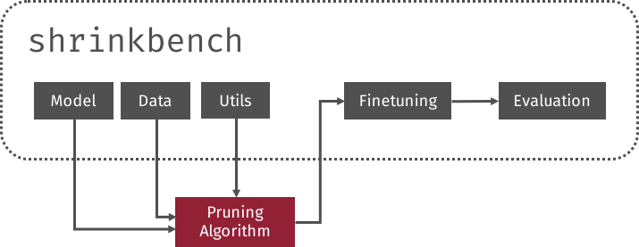

## ShrinkBench

Open source PyTorch library to facilitate development and  standardized evaluation of neural network pruning methods

Presented at SOSP2019 AI Systems Workshop. 

- [Paper](jjgo-aisystems2019.pdf)
- [Slides](slides-sosp19-aisystems-shrinkbench-v3.pdf)

Repo with code is [github.com/shrinkbench/shrinkbench](https://github.com/shrinkbench/shrinkbench)

